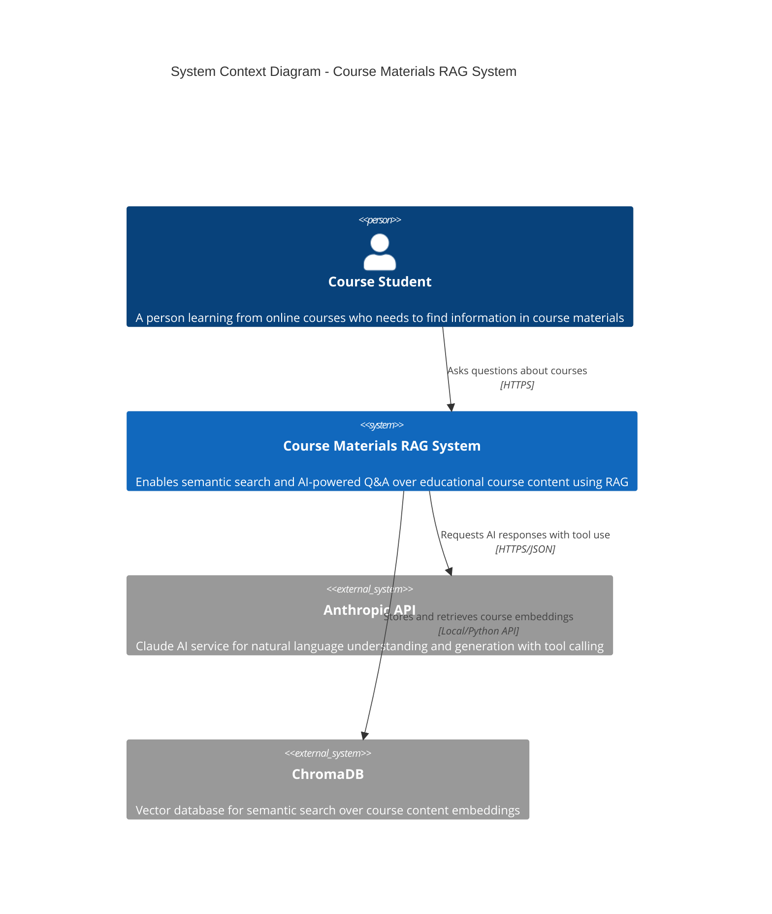
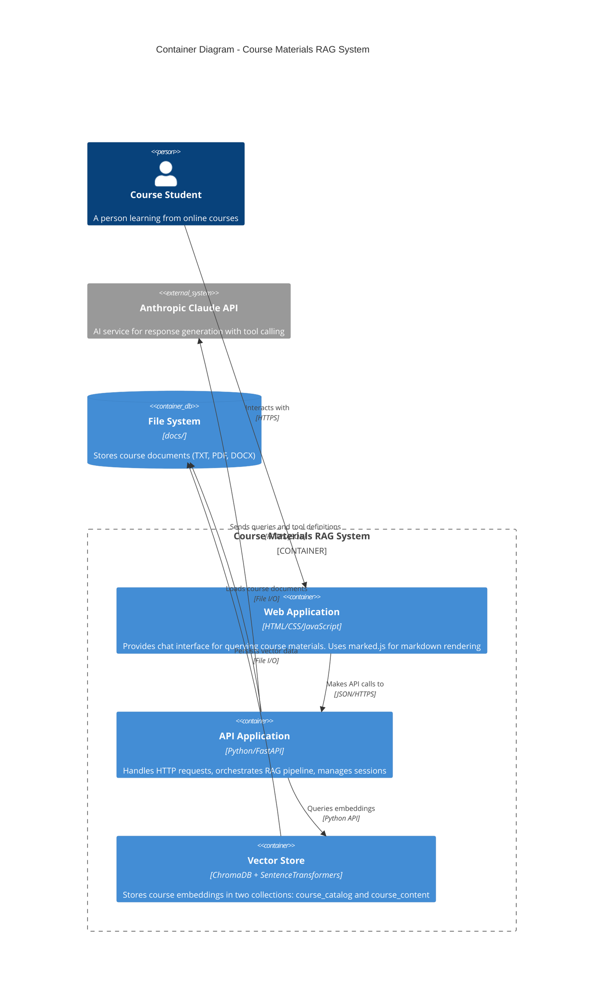
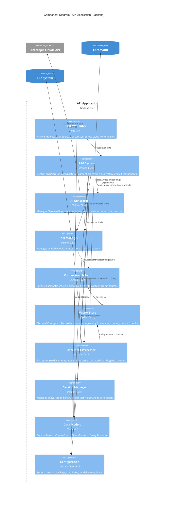
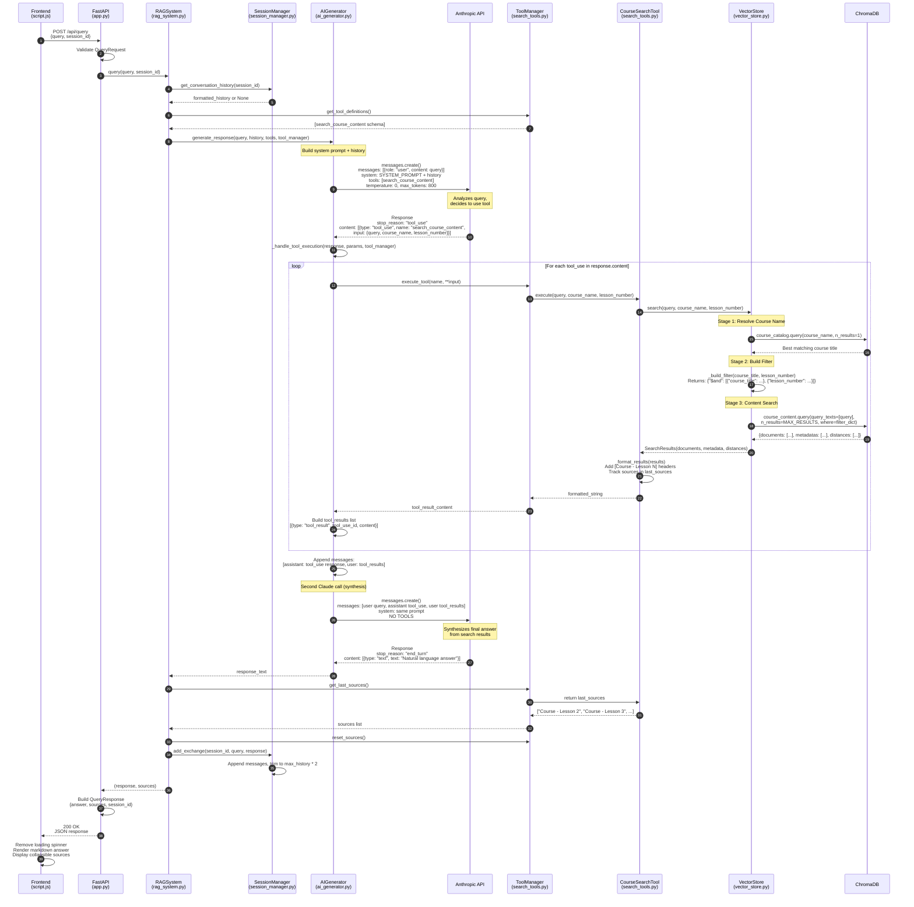
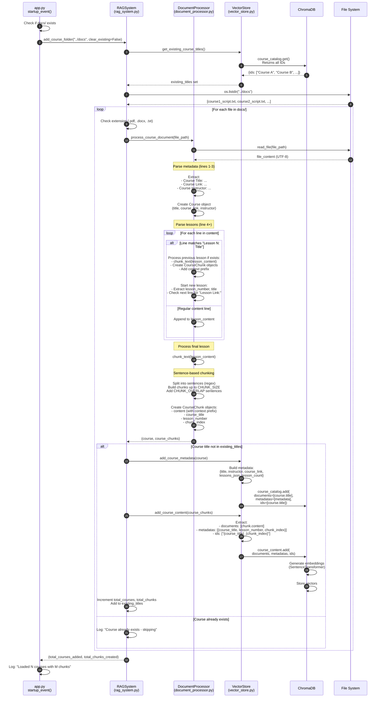
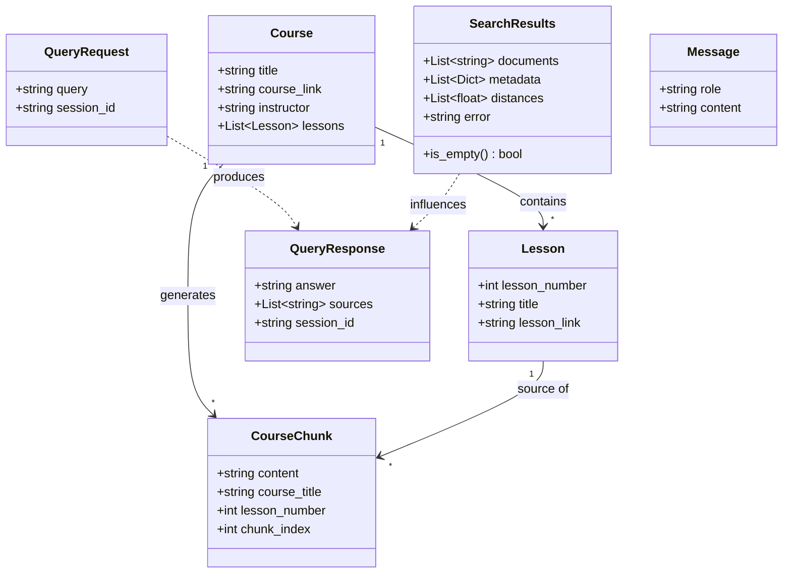
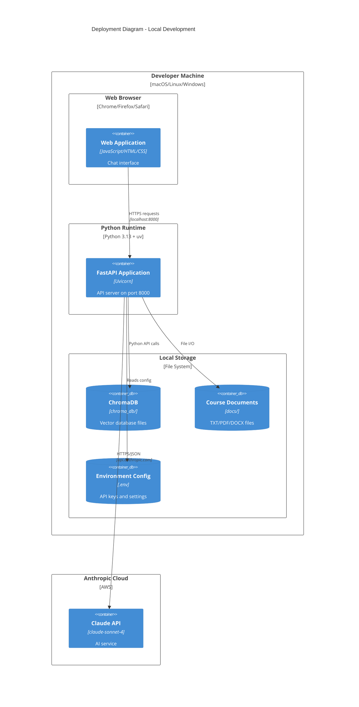

# C4 Architecture Documentation

This document describes the Course Materials RAG System architecture using the C4 model (Context, Container, Component, and Code diagrams).

## Level 1: System Context Diagram

Shows how the system fits into the world around it.

### Key Context Elements

- **User**: Course students who need quick answers about course content
- **RAG System**: The main application providing intelligent search and Q&A
- **Anthropic API**: External Claude AI service for natural language processing
- **ChromaDB**: Embedded vector database for semantic search

---

## Level 2: Container Diagram

Shows the high-level technical building blocks.

### Container Descriptions

**Web Application (Frontend)**
- Technology: Vanilla JavaScript, HTML5, CSS3
- Purpose: Single-page chat interface
- Key Features: Session management, markdown rendering, source display

**API Application (Backend)**
- Technology: Python 3.13, FastAPI, Uvicorn
- Purpose: HTTP API and RAG orchestration
- Key Features: Query processing, document ingestion, session tracking

**Vector Store**
- Technology: ChromaDB 1.0.15, SentenceTransformers (all-MiniLM-L6-v2)
- Purpose: Semantic search over course embeddings
- Key Features: Dual collections, filtered search, fuzzy course matching

---

## Level 3: Component Diagram

Shows the internal components of the API Application container.

### Component Responsibilities

**FastAPI Router** (`app.py`)
- Exposes REST endpoints
- Validates requests with Pydantic models
- Serves static frontend files
- Loads initial documents on startup

**RAG System** (`rag_system.py`)
- Central orchestrator for all operations
- Manages document ingestion pipeline
- Coordinates query processing flow
- Owns component lifecycle

**AI Generator** (`ai_generator.py`)
- Implements dual Claude API call pattern
- First call: Claude decides to use tools
- Second call: Claude synthesizes results
- Manages system prompt and conversation history

**Tool Manager** (`search_tools.py`)
- Abstract tool registration system
- Routes tool execution by name
- Collects and resets sources for UI

**Course Search Tool** (`search_tools.py`)
- Implements semantic search logic
- Formats results with course/lesson context
- Tracks sources for frontend display

**Vector Store** (`vector_store.py`)
- Wraps ChromaDB with two collections
- Three-stage search: resolve course → build filter → search content
- Supports fuzzy course name matching
- Manages embeddings lifecycle

**Document Processor** (`document_processor.py`)
- Parses structured course documents
- Extracts metadata (title, instructor, lessons)
- Implements sentence-based chunking
- Enriches chunks with contextual prefixes

**Session Manager** (`session_manager.py`)
- Creates and tracks conversation sessions
- Stores message history (max N exchanges)
- Formats history for system prompt injection

---

## Level 4: Code Diagram - Query Processing Flow

Shows the detailed interaction for processing a user query.

### Key Code-Level Patterns

**Dual Claude API Call Pattern**
1. First call includes tools → Claude returns `stop_reason="tool_use"`
2. Tool execution → Results added to message history
3. Second call without tools → Forces synthesis → Returns `stop_reason="end_turn"`

**Three-Stage Vector Search**
1. Fuzzy course name resolution via semantic search on `course_catalog`
2. Filter construction from resolved course title and lesson number
3. Content search on `course_content` with filters and embeddings

**Message History Management**
1. History retrieved before each query
2. Formatted as "User: ...\nAssistant: ..." string
3. Appended to system prompt
4. Updated after response with new exchange
5. Trimmed to `max_history * 2` messages

**Source Tracking**
1. Sources captured during `_format_results()` in `CourseSearchTool`
2. Stored in instance variable `last_sources`
3. Retrieved by RAG system via `ToolManager.get_last_sources()`
4. Reset after retrieval to avoid contamination

---

## Level 4: Code Diagram - Document Ingestion Flow

Shows the detailed process of adding course documents to the system.

### Document Processing Details

**File Format Parsing**
- Line 1: `Course Title: [title]`
- Line 2: `Course Link: [url]`
- Line 3: `Course Instructor: [name]`
- Line 4+: `Lesson N: [title]` markers followed by content

**Chunking Strategy**
- Sentence-based splitting using regex: `(?<!\w\.\w.)(?<![A-Z][a-z]\.)(?<=\.|\!|\?)\s+(?=[A-Z])`
- Builds chunks up to `CHUNK_SIZE` (800 chars) without breaking sentences
- Adds `CHUNK_OVERLAP` (100 chars) by including sentences from previous chunk
- Ensures smooth semantic continuity between chunks

**Context Enrichment**
- First chunk of lesson: `"Lesson {N} content: {chunk}"`
- Last lesson chunks: `"Course {title} Lesson {N} content: {chunk}"`
- Improves retrieval by adding explicit context markers

**Duplicate Prevention**
- Queries existing course titles before processing
- Compares parsed course title against existing set
- Skips processing if match found
- Uses course title as unique identifier

---

## Data Model

---

## Key Architectural Decisions

### ADR-001: Tool-Based RAG with Dual Claude API Calls

**Context**: Need to leverage Claude's reasoning to decide when to search vs. answer directly.

**Decision**: Use Claude's tool calling feature with a two-call pattern:
1. First call: Claude analyzes query and decides whether to use search tool
2. Second call: Claude synthesizes search results into natural language

**Consequences**:
- **Positive**: Claude can answer general questions without search, reducing unnecessary vector queries
- **Positive**: Claude's reasoning improves search query formulation
- **Negative**: Increased latency (two API calls)
- **Negative**: Higher API costs (two Claude invocations per query)

### ADR-002: Dual ChromaDB Collections

**Context**: Need to support both course-level discovery and content-level search.

**Decision**: Maintain two separate collections:
- `course_catalog`: Course metadata for fuzzy course name matching
- `course_content`: Chunked content for semantic search

**Consequences**:
- **Positive**: Fuzzy course name matching ("Prompt Caching" → "Intro to Prompt Caching with Anthropic")
- **Positive**: Efficient filtering by resolved course name
- **Negative**: Two separate indexing operations during ingestion
- **Negative**: Increased storage overhead

### ADR-003: Sentence-Based Chunking with Overlap

**Context**: Need to balance chunk size for embedding quality vs. context preservation.

**Decision**: Use sentence-aware chunking with 800 character chunks and 100 character overlap.

**Consequences**:
- **Positive**: Chunks don't break mid-sentence, preserving semantic meaning
- **Positive**: Overlap ensures important information at chunk boundaries isn't lost
- **Negative**: More chunks than fixed-size chunking (increased storage)
- **Negative**: Complex chunking logic with sentence detection

### ADR-004: Context Enrichment for Chunks

**Context**: Vector search may return chunks without sufficient context about their source.

**Decision**: Prepend contextual information to chunks:
- `"Lesson {N} content: {chunk}"` for lesson starts
- `"Course {title} Lesson {N} content: {chunk}"` for later chunks

**Consequences**:
- **Positive**: Improved retrieval accuracy (embeddings include course/lesson context)
- **Positive**: Claude receives explicit source context in search results
- **Negative**: Increased chunk size and embedding computation
- **Negative**: Potential bias toward chunks with rich prefixes

### ADR-005: Session-Based Conversation History

**Context**: Users may ask follow-up questions requiring previous context.

**Decision**: Store last `MAX_HISTORY` exchanges per session, inject into system prompt.

**Consequences**:
- **Positive**: Supports multi-turn conversations
- **Positive**: Claude can reference previous answers
- **Negative**: Increased prompt size (context window usage)
- **Negative**: Session state must be managed (memory overhead)

---

## Deployment View

### Deployment Notes

**Local Development**:
- Single machine deployment
- Frontend served as static files by FastAPI
- ChromaDB runs embedded (no separate server)
- Environment variables in `.env` file

**Production Considerations** (not implemented):
- Separate frontend hosting (CDN)
- Persistent vector database (external ChromaDB server)
- API key management (secrets manager)
- Horizontal scaling requires session state externalization
- Rate limiting and authentication not implemented

---

## Technology Stack Summary

| Layer | Technology | Version | Purpose |
|-------|-----------|---------|---------|
| **Frontend** | Vanilla JavaScript | ES6+ | UI logic and API client |
| | HTML5/CSS3 | - | Page structure and styling |
| | marked.js | - | Markdown rendering |
| **Backend** | Python | 3.13+ | Application runtime |
| | FastAPI | 0.116.1 | Web framework and API |
| | Uvicorn | 0.35.0 | ASGI server |
| | Pydantic | - | Data validation |
| **AI/ML** | Anthropic API | 0.58.2 | Claude AI integration |
| | SentenceTransformers | 5.0.0 | Embedding generation |
| | Model: all-MiniLM-L6-v2 | - | 384-dim embeddings |
| **Database** | ChromaDB | 1.0.15 | Vector database |
| **Build** | uv | - | Python package manager |
| **Config** | python-dotenv | 1.1.1 | Environment variables |

---

## Glossary

**RAG (Retrieval-Augmented Generation)**: Pattern where LLM responses are enhanced with retrieved context from a knowledge base.

**Tool Calling**: Claude API feature allowing the model to request execution of predefined functions.

**Embedding**: Vector representation of text that captures semantic meaning (384 dimensions in this system).

**Semantic Search**: Finding similar content based on meaning rather than keyword matching.

**Chunk**: Fixed-size text segment created from larger documents for vector storage.

**Session**: Conversation context tracked across multiple query-response exchanges.

**Course Catalog**: ChromaDB collection storing course metadata for fuzzy name matching.

**Course Content**: ChromaDB collection storing chunked course text with embeddings.

**System Prompt**: Instructions given to Claude defining its behavior and capabilities.

**Stop Reason**: Claude API response field indicating why generation stopped (e.g., "tool_use", "end_turn").
