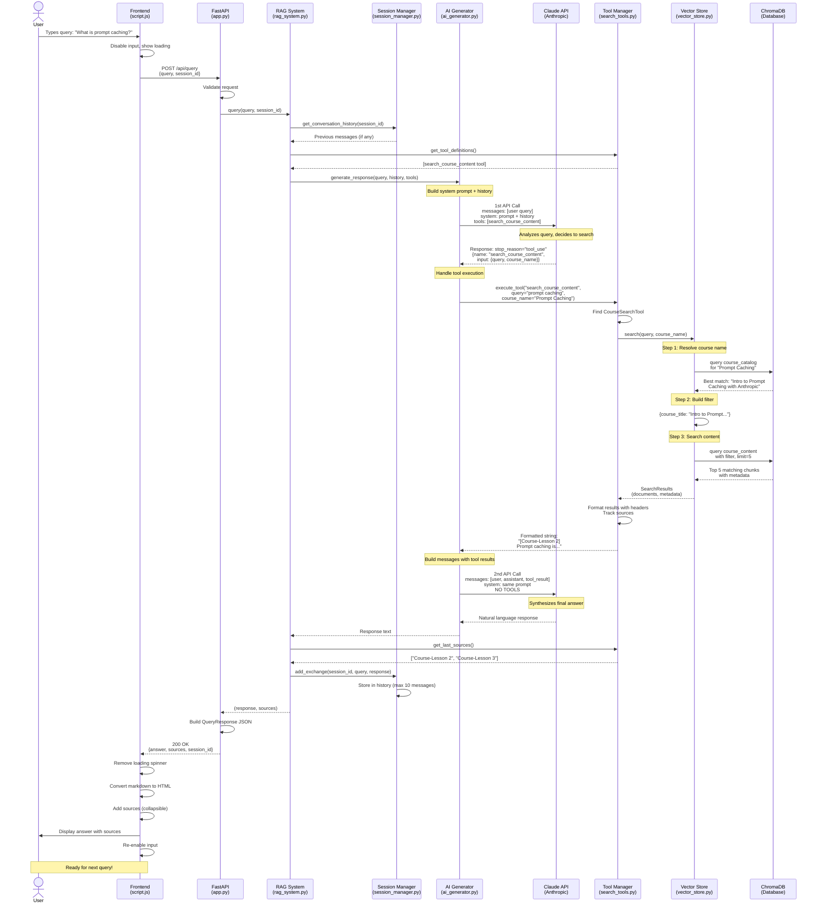

# RAG System Query Flow Diagram

```
┌─────────────────────────────────────────────────────────────────────────────┐
│                              FRONTEND (script.js)                            │
└─────────────────────────────────────────────────────────────────────────────┘
                                      │
                    User types: "What is prompt caching?"
                                      │
                                      ▼
                          ┌───────────────────────┐
                          │  sendMessage() :45    │
                          │  - Disable input      │
                          │  - Show loading       │
                          └───────────────────────┘
                                      │
                                      │ POST /api/query
                                      │ { query, session_id }
                                      ▼
┌─────────────────────────────────────────────────────────────────────────────┐
│                           BACKEND API (app.py)                               │
└─────────────────────────────────────────────────────────────────────────────┘
                                      │
                          ┌───────────────────────┐
                          │ query_documents() :56 │
                          │ - Create/get session  │
                          └───────────────────────┘
                                      │
                                      ▼
┌─────────────────────────────────────────────────────────────────────────────┐
│                          RAG SYSTEM (rag_system.py)                          │
└─────────────────────────────────────────────────────────────────────────────┘
                                      │
                          ┌───────────────────────┐
                          │     query() :102      │
                          └───────────────────────┘
                                      │
                  ┌───────────────────┴───────────────────┐
                  ▼                                       ▼
      ┌───────────────────────┐            ┌────────────────────────┐
      │  SessionManager :119  │            │  AIGenerator :122      │
      │  - Get conversation   │            │  - Get tool defs       │
      │    history            │            │  - Pass history        │
      └───────────────────────┘            └────────────────────────┘
                                                       │
                                                       ▼
┌─────────────────────────────────────────────────────────────────────────────┐
│                      AI GENERATOR (ai_generator.py)                          │
└─────────────────────────────────────────────────────────────────────────────┘
                                      │
                  ┌───────────────────┴───────────────────┐
                  │   generate_response() :43             │
                  │   Build system prompt + history       │
                  └───────────────────────────────────────┘
                                      │
                                      ▼
                  ┌───────────────────────────────────────┐
                  │    1st Claude API Call :80            │
                  │                                       │
                  │  messages: [user query]               │
                  │  system: prompt + history             │
                  │  tools: [search_course_content]       │
                  │  temperature: 0                       │
                  └───────────────────────────────────────┘
                                      │
                        Claude analyzes and decides to use tool
                                      │
                                      ▼
                  ┌───────────────────────────────────────┐
                  │  Response: stop_reason="tool_use"     │
                  │                                       │
                  │  {                                    │
                  │    name: "search_course_content",     │
                  │    input: {                           │
                  │      query: "prompt caching",         │
                  │      course_name: "Prompt Caching"    │
                  │    }                                  │
                  │  }                                    │
                  └───────────────────────────────────────┘
                                      │
                                      ▼
                  ┌───────────────────────────────────────┐
                  │  _handle_tool_execution() :89         │
                  └───────────────────────────────────────┘
                                      │
                                      ▼
┌─────────────────────────────────────────────────────────────────────────────┐
│                       TOOL MANAGER (search_tools.py)                         │
└─────────────────────────────────────────────────────────────────────────────┘
                                      │
                  ┌───────────────────┴───────────────────┐
                  │    execute_tool() :135                │
                  │    Finds: CourseSearchTool            │
                  └───────────────────────────────────────┘
                                      │
                                      ▼
                  ┌───────────────────────────────────────┐
                  │   CourseSearchTool.execute() :52      │
                  └───────────────────────────────────────┘
                                      │
                                      ▼
┌─────────────────────────────────────────────────────────────────────────────┐
│                        VECTOR STORE (vector_store.py)                        │
└─────────────────────────────────────────────────────────────────────────────┘
                                      │
                  ┌───────────────────┴───────────────────┐
                  │       search() :61                    │
                  └───────────────────────────────────────┘
                                      │
                  ┌───────────────────┴───────────────────┐
                  │                                       │
                  ▼                                       ▼
    ┌──────────────────────────┐          ┌─────────────────────────┐
    │  STEP 1: Resolve Course  │          │   CHROMADB DATABASE     │
    │  _resolve_course_name()  │          │                         │
    │  :102                    │◄─────────┤  • course_catalog       │
    │                          │          │    (titles, metadata)   │
    │  Semantic search in      │          │                         │
    │  course_catalog          │          │  • course_content       │
    │                          │          │    (text chunks)        │
    │  "Prompt Caching"        │          │                         │
    │         ↓                │          │  Embeddings:            │
    │  "Intro to Prompt        │          │  SentenceTransformer    │
    │   Caching with Anthropic"│          └─────────────────────────┘
    └──────────────────────────┘
                  │
                  ▼
    ┌──────────────────────────┐
    │  STEP 2: Build Filter    │
    │  _build_filter() :118    │
    │                          │
    │  {                       │
    │    "course_title":       │
    │    "Intro to Prompt..."  │
    │  }                       │
    └──────────────────────────┘
                  │
                  ▼
    ┌──────────────────────────┐
    │  STEP 3: Content Search  │
    │  course_content.query()  │
    │  :93                     │
    │                          │
    │  Query: "prompt caching" │
    │  Filter: course_title    │
    │  Limit: 5 results        │
    └──────────────────────────┘
                  │
                  ▼
    ┌──────────────────────────┐
    │  RESULTS (top 5)         │
    │                          │
    │  1. [Course - Lesson 2]  │
    │     "Prompt caching..."  │
    │                          │
    │  2. [Course - Lesson 3]  │
    │     "Implementation..."  │
    │                          │
    │  3. [Course - Lesson 1]  │
    │     "Introduction to..." │
    │  ...                     │
    └──────────────────────────┘
                  │
                  ▼
┌─────────────────────────────────────────────────────────────────────────────┐
│                      BACK TO TOOL (search_tools.py)                          │
└─────────────────────────────────────────────────────────────────────────────┘
                                      │
                  ┌───────────────────┴───────────────────┐
                  │   _format_results() :88               │
                  │                                       │
                  │   Format with headers                 │
                  │   Track sources                       │
                  │   last_sources = [...]                │
                  └───────────────────────────────────────┘
                                      │
                  Returns formatted string to AI Generator
                                      │
                                      ▼
┌─────────────────────────────────────────────────────────────────────────────┐
│                    BACK TO AI GENERATOR (ai_generator.py)                    │
└─────────────────────────────────────────────────────────────────────────────┘
                                      │
                  ┌───────────────────────────────────────┐
                  │   Build messages with tool results    │
                  │                                       │
                  │   messages = [                        │
                  │     {role: "user", ...},              │
                  │     {role: "assistant", tool_use},    │
                  │     {role: "user", tool_result}       │
                  │   ]                                   │
                  └───────────────────────────────────────┘
                                      │
                                      ▼
                  ┌───────────────────────────────────────┐
                  │    2nd Claude API Call :134           │
                  │                                       │
                  │  messages: [with tool results]        │
                  │  system: same prompt                  │
                  │  NO TOOLS (synthesis only)            │
                  └───────────────────────────────────────┘
                                      │
                        Claude synthesizes final answer
                                      │
                                      ▼
                  ┌───────────────────────────────────────┐
                  │  Response: Natural language answer    │
                  │                                       │
                  │  "Prompt caching is a technique       │
                  │   that stores frequently used         │
                  │   context to reduce API costs..."     │
                  └───────────────────────────────────────┘
                                      │
                                      ▼
┌─────────────────────────────────────────────────────────────────────────────┐
│                      BACK TO RAG SYSTEM (rag_system.py)                      │
└─────────────────────────────────────────────────────────────────────────────┘
                                      │
                  ┌───────────────────┴───────────────────┐
                  │                                       │
                  ▼                                       ▼
      ┌───────────────────────┐            ┌────────────────────────┐
      │  Get sources :130     │            │  Update history :137   │
      │  from ToolManager     │            │  SessionManager        │
      │                       │            │                        │
      │  sources = [          │            │  add_exchange(         │
      │   "Course-Lesson 2",  │            │    query,              │
      │   "Course-Lesson 3"   │            │    response            │
      │  ]                    │            │  )                     │
      └───────────────────────┘            └────────────────────────┘
                                      │
                                      ▼
                  ┌───────────────────────────────────────┐
                  │  Return (response, sources)           │
                  └───────────────────────────────────────┘
                                      │
                                      ▼
┌─────────────────────────────────────────────────────────────────────────────┐
│                         BACK TO API (app.py)                                 │
└─────────────────────────────────────────────────────────────────────────────┘
                                      │
                  ┌───────────────────────────────────────┐
                  │  Build JSON response :68              │
                  │                                       │
                  │  {                                    │
                  │    "answer": "Prompt caching is...",  │
                  │    "sources": ["Course-Lesson 2"],    │
                  │    "session_id": "session_1"          │
                  │  }                                    │
                  └───────────────────────────────────────┘
                                      │
                                      │ HTTP 200 Response
                                      │
                                      ▼
┌─────────────────────────────────────────────────────────────────────────────┐
│                        BACK TO FRONTEND (script.js)                          │
└─────────────────────────────────────────────────────────────────────────────┘
                                      │
                  ┌───────────────────┴───────────────────┐
                  │   Parse response :76                  │
                  │   - Remove loading spinner            │
                  │   - Update session_id                 │
                  └───────────────────────────────────────┘
                                      │
                                      ▼
                  ┌───────────────────────────────────────┐
                  │   addMessage() :113                   │
                  │   - Convert markdown to HTML          │
                  │   - Add sources (collapsible)         │
                  │   - Scroll to bottom                  │
                  └───────────────────────────────────────┘
                                      │
                                      ▼
                  ┌───────────────────────────────────────┐
                  │   Re-enable input :92                 │
                  │   Ready for next query!               │
                  └───────────────────────────────────────┘

═══════════════════════════════════════════════════════════════════════════════

KEY COMPONENTS:

┌─────────────┐  ┌──────────────┐  ┌─────────────┐  ┌──────────────┐
│  Frontend   │  │  FastAPI     │  │  RAG System │  │  ChromaDB    │
│  (UI/UX)    │→ │  (Routing)   │→ │  (Orchestr) │→ │  (Vector DB) │
└─────────────┘  └──────────────┘  └─────────────┘  └──────────────┘
                                           ↓
                                    ┌─────────────┐
                                    │  Claude API │
                                    │  (Tool Use) │
                                    └─────────────┘

DATA FLOW:
1. User Query → API Endpoint
2. Get Session History → Build Context
3. Claude Call #1 → Decides to search
4. Vector Search → Semantic matching
5. Tool Results → Back to Claude
6. Claude Call #2 → Synthesizes answer
7. Save History → Return response
8. Frontend Renders → User sees answer

SESSION STATE:
• session_id tracks conversation across queries
• SessionManager stores last 5 exchanges (10 messages)
• History included in system prompt for context

VECTOR SEARCH:
• 2 Collections: course_catalog (metadata), course_content (chunks)
• SentenceTransformer embeddings
• Semantic matching for fuzzy course name lookup
• Filtered search by course/lesson
```

---

## Standard Sequence Diagram



### Diagram Legend

- **Solid arrows (→)**: Synchronous calls
- **Dashed arrows (- -)**: Return values
- **Notes**: Important processing steps or decision points
- **Boxes**: System components/modules

### Key Interactions

1. **Two Claude API Calls**:
   - First call: Claude decides to use the search tool
   - Second call: Claude synthesizes the final answer from search results

2. **Three-Stage Vector Search**:
   - Course name resolution via semantic matching
   - Filter construction for precise targeting
   - Content search with embeddings and filters

3. **Session Continuity**:
   - History retrieved before each query
   - Updated after each response
   - Limited to 10 messages (5 exchanges)

4. **Source Tracking**:
   - Captured during search formatting
   - Stored in tool instance
   - Retrieved after AI generation
   - Returned to frontend for display
